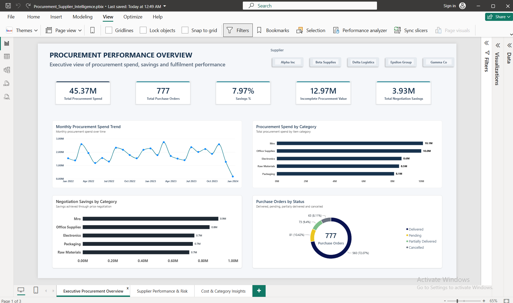
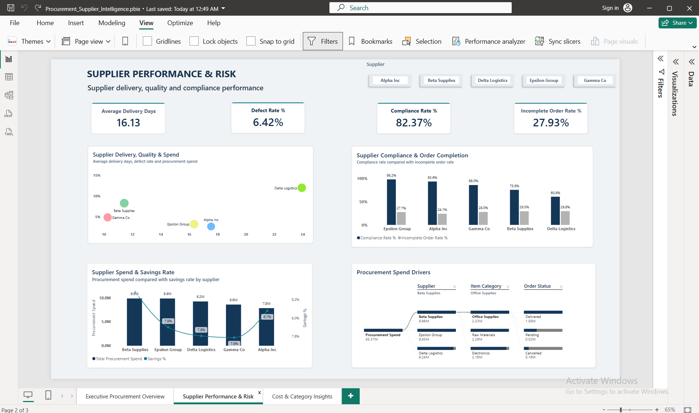
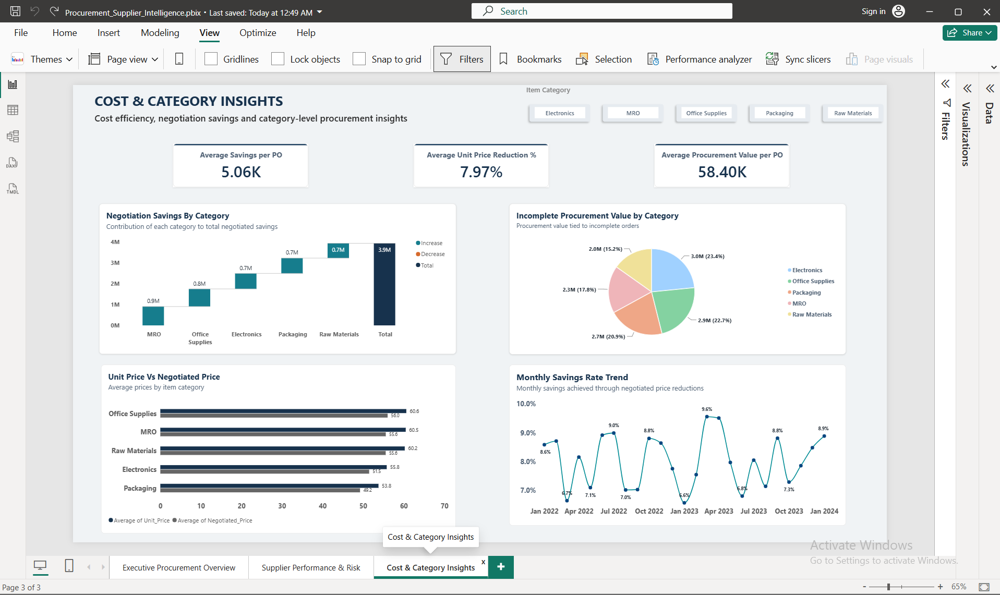

# Procurement & Supplier Intelligence

End-to-end procurement and supplier analysis using Python, SQL and Power BI.

## Project Overview

This is an end-to-end procurement analytics project using Python, SQL and Power BI.

The project focuses on understanding procurement spend, supplier performance, negotiated pricing, delivery, compliance and incomplete orders. The analysis was used to identify patterns in procurement performance and present the findings through an interactive Power BI dashboard.

The dataset contains **777 purchase orders across 5 suppliers and 5 item categories**, with information such as order dates, delivery dates, quantities, original prices, negotiated prices, defective units, compliance and order status.

## Business Questions

The analysis was built around the following questions:

- How much is being spent on procurement?
- How much savings are coming from negotiated prices?
- How is procurement spend distributed across suppliers and categories?
- How do suppliers differ in delivery time and compliance?
- How many purchase orders are incomplete?
- How much procurement value is associated with incomplete orders?
- How do original unit prices compare with negotiated prices?
- Which supplier and category-level patterns stand out in the data?

## Tools Used

- **Python** – data cleaning and exploratory analysis
- **SQL (MySQL)** – business analysis and aggregations
- **Power BI** – DAX measures, dashboard development and data visualization

## Project Workflow

**Data Cleaning & EDA → SQL Analysis → Power BI Dashboard → Insights & Recommendations**

### Python

The dataset was cleaned and explored using Python before moving into the SQL and Power BI analysis.

The main steps included:

- Checking data types
- Checking missing values
- Checking duplicate records
- Exploring basic distributions and trends
- Creating analysis-ready fields such as delivery days
- Performing exploratory analysis using Pandas, NumPy and Matplotlib

After cleaning, the final dataset contained **777 records with no missing values or duplicate rows**.

### SQL

The cleaned data was imported into MySQL and analyzed using SQL.

The analysis covered:

- Overall procurement spend
- Purchase order volume
- Supplier-level spend
- Category-level spend
- Delivery performance
- Compliance
- Order status
- Incomplete orders
- Negotiation savings
- Original vs negotiated pricing

SQL was used to turn the cleaned dataset into business-level metrics and comparisons that were later used in the Power BI dashboard.

### Power BI

The final analysis was presented through a 3-page interactive dashboard.

**Page 1 – Procurement Performance Overview**

Provides an overall view of procurement activity, including total procurement spend, purchase orders, savings, incomplete procurement value, category spend and order status.

**Page 2 – Supplier Performance & Risk**

Focuses on supplier delivery days, defect rate, compliance, incomplete order rate, supplier spend, savings rate and supplier-level performance.

**Page 3 – Cost & Category Insights**

Focuses on negotiation savings by category, incomplete procurement value, original vs negotiated unit prices and the monthly savings rate trend.

## Key Metrics

| Metric | Value |
| Total Procurement Spend | ₹45.37M |
| Purchase Orders | 777 |
| Total Negotiation Savings | ₹3.93M |
| Overall Savings Rate | 7.97% |
| Incomplete Procurement Value | ₹12.97M |
| Incomplete Order Rate | 27.93% |
| Average Delivery Days | 16.13 |
| Compliance Rate | 82.37% |
| Defect Rate | 6.42% |

## Key Insights

### 1. Negotiated pricing generated meaningful savings

Total procurement spend was **₹45.37M**, while total negotiation savings were around **₹3.93M**, resulting in an overall savings rate of **7.97%**.

This shows that negotiated pricing made a meaningful difference to procurement cost in the dataset.

### 2. Supplier delivery performance varied considerably

Average delivery time ranged from **10.27 days for Gamma Co to 23.94 days for Delta Logistics**, a difference of nearly **14 days**.

This shows that supplier performance can vary significantly in terms of delivery timelines.

### 3. Supplier compliance was not consistent

Supplier compliance ranged from **60.82% to 98.19%**.

This indicates that supplier performance should be looked at using compliance and delivery along with spend rather than considering cost alone.

### 4. More than one-fourth of purchase orders were incomplete

Out of **777 purchase orders, 217 were pending, partially delivered or cancelled**, resulting in an **Incomplete Order Rate of 27.93%**.

This makes order fulfilment an important area to monitor.

### 5. Incomplete orders involved a significant amount of procurement value

Incomplete orders were associated with approximately **₹12.97M in procurement value**.

So the issue is not only the number of incomplete orders, but also the amount of procurement value tied to them.

### 6. MRO and Office Supplies had the highest procurement spend

**MRO accounted for approximately ₹10.13M** of procurement spend, followed by **Office Supplies at approximately ₹10.01M**.

These categories could therefore be useful areas for future price reviews and negotiation efforts.

### 7. Procurement spend was spread across suppliers

Supplier-level spend ranged from approximately **₹7.84M to ₹9.86M**.

This indicates that procurement spend was distributed across multiple suppliers rather than being heavily concentrated with one supplier.

### 8. Negotiated prices were lower than original unit prices

The average unit price reduction calculated in Power BI was **7.97%**, based on the average row-level reduction between the original unit price and negotiated unit price.

This provides another view of how negotiated pricing affected procurement costs.

## Recommendations

Based on the analysis, a few practical areas could be monitored more closely:

- Review supplier delivery, compliance and incomplete-order rates together when assessing supplier performance.
- Prioritize high-value or long-pending incomplete orders for follow-up.
- Focus price reviews and negotiation efforts on higher-spend categories such as MRO and Office Supplies.
- Continue comparing original and negotiated prices to track whether negotiated pricing is reducing unit costs.
- Consider supplier performance along with spend when reviewing supplier allocation.

## What I Learned

This project gave me hands-on practice with the complete data analytics process, from cleaning and exploring data in Python to using SQL for business analysis and presenting the results through Power BI.
Working with the same dataset across all three tools also helped me understand how technical analysis connects to business questions. I was able to look at procurement from different angles, including spend, supplier performance, fulfilment and negotiated savings, and turn those findings into clear, practical insights.

## Dashboard

### Page 1 – Procurement Performance Overview



### Page 2 – Supplier Performance & Risk



### Page 3 – Cost & Category Insights



## Project Structure

```text
Procurement-Supplier-Intelligence/
├── data/
│   └── ProcurementSense clean.xlsx
├── python/
│   └── procurement_supplier_intelligence.ipynb
├── sql/
│   └── procurement_analysis.sql
├── powerbi/
│   └── Procurement_Supplier_Intelligence.pbix
├── screenshots/
│   ├── page1_procurement_overview.png
│   ├── page2_supplier_performance.png
│   └── page3_cost_category_insights.png
└── README.md
